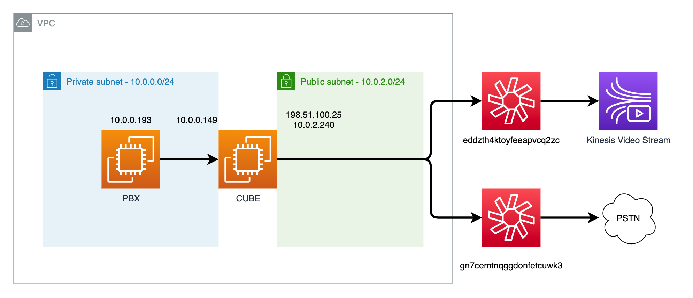
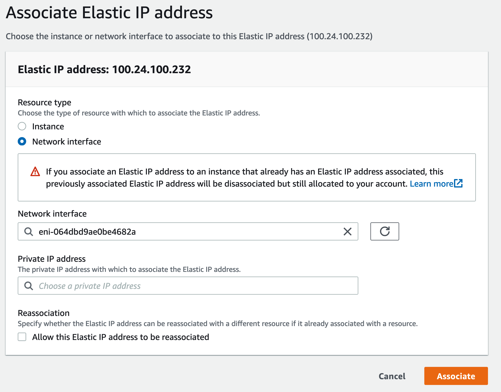
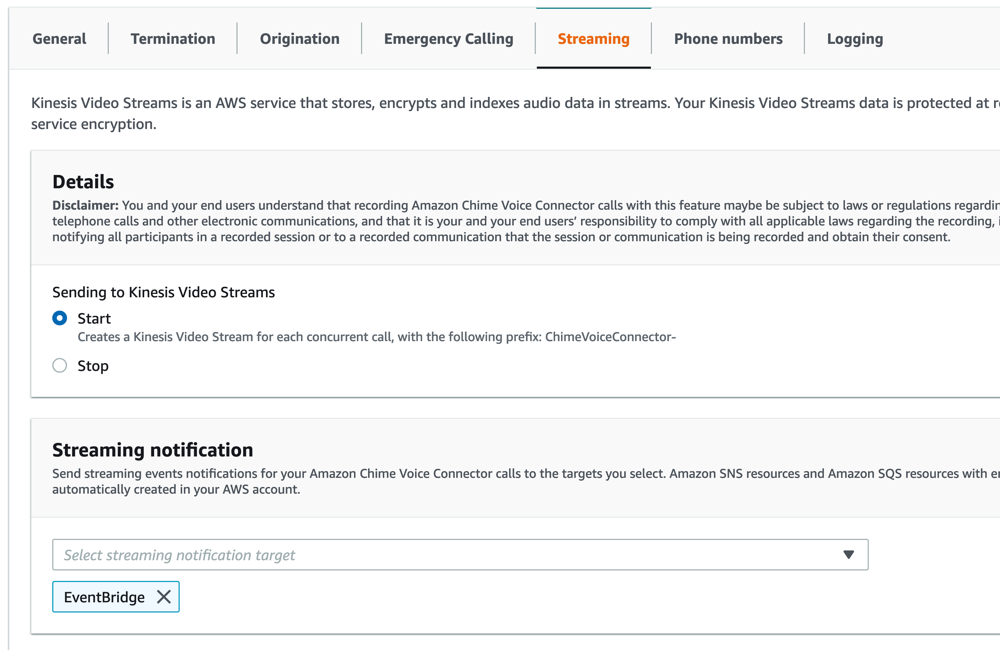

# Configuring a CUBE for use with AmazonAmazon Chime SDK Voice Connector with SIPREC

## Preparing Network

In these instructions, the following high level design will be used:



This design uses two subnets in a single VPC. The Private subnet contains the PBX and one of the CUBE interfaces and the Public subnet contains the other CUBE interface and an Internet Gateway to access theAmazon Chime SDK Voice Connectors. Please review [this](https://docs.aws.amazon.com/vpc/latest/userguide/VPC_Scenario2.html) for instructions on creating a VPC with this type of networking and security. There are a few differences between the example and this design. Instead of using a NAT Gateway, the private subnet interface of the CUBE will be used to connect the private subnet to the public subnet through the CUBE. Security rules should also be changed to allow for SIP and RTP traffic between the devices instead of HTTP(S) traffic. Ensure that both subnets created are in the same Availability Zone.

## Deploying Cisco CUBE in EC2

To deploy a Cisco CUBE on EC2 to be used with an AmazonAmazon Chime SDK Voice Connector, follow the instructions [here](https://aws.amazon.com/marketplace/pp/prodview-7thubduw5se5q) or [here](https://aws.amazon.com/marketplace/pp/prodview-b75wijpubtr3k) depending on what licenses you wish to use. Choosing to launch through EC2 will allow you to select the correct subnets and attach a second interface to the CUBE. After selecting the appropriate VPC in the Instance Details, attach a second network interface:


Select the Public Subnet as the first interface and the Private Subnet for the second interface. Because Public IPs cannot be assigned to an instance with multiple network interfaces we will need to use an Elastic IP for routing to the public internet. Add Tags and Security Groups as necessary. The default Security Group will only allow SSH so a new Security Group will be configured later to accommodate SIP and RTP to the Amazon Chime SDK Voice Connector. Select or create a Key Pair and launch the instance.

### Associating an Elastic IP

In order to connect the CUBE to the internet, an [Elastic IP](https://docs.aws.amazon.com/AWSEC2/latest/UserGuide/elastic-ip-addresses-eip.html) address must be associated. Take note of the Interface ID of the Primary network interface in the Networking tab of the Instance. This will be used to associate an EIP. After Allocating an Elastic IP address, select it and select Associate Elastic IP address under Actions. Choose Network interface as the Resource type and Associate:



## Configuring Voice Connectors

### Configuring Security Groups

The private subnet should have a Security Group that allows the network interface to communicate SIP and RTP to the desired devices. The public subnet should have a Security Group that allows the network interface to communicate SIP and RTP to the Amazon Chime SDK Voice Connector IP addresses. These addresses can be found [here](https://docs.aws.amazon.com/chime/latest/ag/network-config.html#cvc) and include both Signaling and Media ranges that are required for Voice Connectors in us-east-1 and us-west-2. More information on Security Groups and best practices can be found [here](https://docs.aws.amazon.com/vpc/latest/userguide/VPC_SecurityGroups.html)

### Creating Amazon Chime SDK Voice Connectors

In this example, two Voice Connectors will be created. One will be used for standard PSTN access and one will be used for SIPREC media recording. In practice, it is unlikely that this design would be used because the Voice Connector used for PSTN access could have streaming enabled. However, if your CUBE is not using Amazon Chime SDK Voice Connector for PSTN access, this example will help describe the method of configuring the CUBE to support both PSTN access and SIPREC recording. To create the PSTN access Amazon Chime SDK Voice Connector, follow the instructions [here](https://docs.aws.amazon.com/chime/latest/ag/create-voicecon.html) and [here](https://docs.aws.amazon.com/chime/latest/ag/provision-phone.html) to create the Amazon Chime SDK Voice Connector and assign a Phone Number to it. To create the SIPREC Amazon Chime SDK Voice Connector, follow the instructions [here](https://docs.aws.amazon.com/chime/latest/ag/start-kinesis-vc.html#siprec). In this example, both Amazon Chime SDK Voice Connectors will be configured with UDP and without Encryption enabled.

For the PSTN access Amazon Chime SDK Voice Connector, be sure to enable both Termination and Origination. The Allowed hosts list for Termination should be the EIP assigned to the Public subnet network interface. Take note of the Outbound host name as this will be used to configure the CUBE. In the Origination tab, add an Inbound route to the EIP choosing Port 5060 and Protocol UDP.

For the SIPREC Amazon Chime SDK Voice Connector, only the Termination needs to be enabled. The Allowed host list should be the same EIP as the PSTN access Amazon Chimer SDK Voice Connector. Additionally, Streaming should be enabled by sending to Kinesis Video Streams and a Streaming notification enabled. In this example, we will be using EventBridge.


## Configuring the CUBE

### Connecting to the CUBE

Using the associated EIP and key pair, SSH to the CUBE:

`ssh -i 'YOUR_KEY_PAIR.pem' ec2-user@YOUR_EIP`

When properly configured, you should see a typical Cisco router CLI. Please secure this router as you would any other router as it is exposed to the public internet. If the default choices were made, only SSH should be allowed on the CUBE now.

### Configuring Network Interfaces

With two network interfaces attached to the CUBE, they will be listed in the CUBE as GigabitEthernet1 and GigabitEthernet2. GigabitEthernet1 will automatically configured to support dhcp and used as the Public subnet interface. GigabitEthernet2 will need to be configured with the appropriate IP address for the Private subnet interface:


```
int GigabitEthernet2
    ip address PRIVATE_IPv4_ADDRESS PRIVATE_SUBNET_MASK
    no shutdown
```

This will enable the Private subnet interface. Use the appropriate Private IPv4 address and subnet mask that was assigned when the instance was launched.

### Configuring Base VoIP services

```
voice service voip
    no ip address trusted authenticate
    address-hiding
    mode border-element
    allow-connections sip to sip
    no supplementary-service sip handle-replaces
    trace
    sip
        session refresh
        asserted-id pai
        early-offer forced
        midcall-signaling passthru
        privacy-policy passthru
```

### Configuring multiple tenants in CUBE

To use both PSTN access and SIPREC Voice Connectors within the same CUBE, multiple tenants must be configured. Both will use the same public interface.

```
voice class tenant 10
    sip-server dns:PSTN_ACCESS_VOICECONNECTOR.voiceconnector.chime.aws
    bind control source-interface GigabitEthernet1
!
voice class tenant 20
    sip-server dns:SIPREC_VOICECONNECTOR.voiceconnector.chime.aws
    bind control source-interface GigabitEthernet1
```

### Configuring Codecs

```
voice class codec 1
 codec preference 1 g711ulaw
```

Amazon Chime SDK Voice Connector supports only G.711 μlaw so it is the only codec configured

### Configuring the endpoint URIs

```
voice class uri PBX sip
 host IP_ADDRESS_OF_PBX
!
voice class uri VoiceConnector sip
 host dns:PSTN_ACCESS_VOICECONNECTOR.voiceconnector.chime.aws
```

### Configuring Translation Rules

```
voice class e164-pattern-map 100
  e164 +1.........$

voice translation-rule 10
 rule 1 /\(^1..........$\)/ /+\1/

voice translation-profile To-VoiceConnector
 translate called 10
```

AmazonAmazon Chime SDK Voice Connector [requires E.164 dialing](https://docs.aws.amazon.com/chime/latest/ag/voice-connectors.html#vc-prereq). If the PBX is not sending E.164, ensure that E.164 is sent to the Voice Connector with [Translation Rules](https://www.cisco.com/c/en/us/support/docs/voice/call-routing-dial-plans/61083-voice-transla-rules.html).

### Configuring NAT Header Manipulations

```
voice class sip-profiles 1000
 response ANY sip-header Contact modify "INTERFACE_IP_ADDRESS" "EIP_ADDRESS"
 response ANY sip-header P-Asserted-Identity modify "INTERFACE_IP_ADDRESS" "EIP_ADDRESS"
 request ANY sip-header Contact modify "INTERFACE_IP_ADDRESS" "EIP_ADDRESS"
 request ANY sip-header Via modify "INTERFACE_IP_ADDRESS" "EIP_ADDRESS"
 request ANY sdp-header Connection-Info modify "INTERFACE_IP_ADDRESS" "EIP_ADDRESS"
 response ANY sdp-header Connection-Info modify "INTERFACE_IP_ADDRESS" "EIP_ADDRESS"
 response ANY sdp-header Audio-Connection-Info modify "INTERFACE_IP_ADDRESS" "EIP_ADDRESS"
 request ANY sdp-header Audio-Connection-Info modify "INTERFACE_IP_ADDRESS" "EIP_ADDRESS"
```

If hosting the CUBE on an EC2 Instance, the private IP addresses on the Public Subnet need to be replaced with the EIP address. This sip-profile will modify the SIP and SDP headers and is applied to the dial-peers facing the Voice Connector. For more information on using SIP Profiles, see [here](https://www.cisco.com/c/en/us/td/docs/ios-xml/ios/voice/cube/configuration/cube-book/voi-sip-param-mod.html)

### Configuring Dial Plans

#### Outbound Dial Plans (From PBX to PSTN)

```
voice class dpg 100
 description Outbound To PSTN via Voice Connector
 dial-peer 300

dial-peer voice 100 voip
 description ***Inbound Dial-Peer from PBX***
 session protocol sipv2
 session transport udp
 destination dpg 100
 incoming uri via PBX
 voice-class codec 1
 dtmf-relay rtp-nte
 no vad

dial-peer voice 300 voip
 description ***Outbound Dial-Peer to Amazon***
 translation-profile outgoing To-VoiceConnector
 destination-pattern .T
 session protocol sipv2
 session target sip-server
 session transport udp
 voice-class codec 1
 voice-class sip localhost dns:PSTN_ACCESS_VOICECONNECTOR.voiceconnector.chime.aws
 voice-class sip profiles 1000
 voice-class sip tenant 10
 voice-class sip bind control source-interface GigabitEthernet1
 voice-class sip bind media source-interface GigabitEthernet1
 media-class 100
 no vad
```

#### Inbound Dial Plans (From PSTN to PBX)

```
voice class dpg 200
  description Outbound To PBX from Voice Connector
  dial-peer 400

dial-peer voice 200 voip
 description ***Inbound Dial-Peer from Amazon***
 session protocol sipv2
 session transport udp
 destination dpg 200
 incoming uri via VoiceConnector
 incoming called e164-pattern-map 100
 voice-class codec 1
 voice-class sip profiles 1000
 voice-class sip tenant 10
 dtmf-relay rtp-nte
 no vad

dial-peer voice 400 voip
 description ***Outbound Dial-Peer to PBX****
 destination-pattern .T
 session protocol sipv2
 session target ipv4:IP_ADDRESS_OF_PBX
 session transport udp
 voice-class sip bind control source-interface GigabitEthernet2
 voice-class sip bind media source-interface GigabitEthernet2
 voice-class codec 1
 dtmf-relay rtp-nte
 no vad
```

### Configuring SIPREC

```
dial-peer voice 800 voip
 description SIPREC
 translation-profile outgoing To-VoiceConnector
 destination-pattern .T
 session protocol sipv2
 session target sip-server
 voice-class codec 1
 voice-class sip localhost dns:SIPREC_VOICECONNECTOR.voiceconnector.chime.aws preferred
 voice-class sip tenant 20

media profile recorder 100
 media-type audio
 media-recording 800

media class 100
 recorder profile 100 siprec

dial-peer voice 300
 media-class 100

dial-peer voice 200
 media-class 100
```

Once the profile recorder is configured, it can be applied to the appropriate dial-peers. When calls use that dial-peer, the SIPREC will be used. For more information, see [here](https://www.cisco.com/c/en/us/td/docs/ios-xml/ios/voice/cube/configuration/cube-book/voi-sip-recording.html) This configuration uses the second tenant to define the second Voice Connector to be used for SIPREC.
