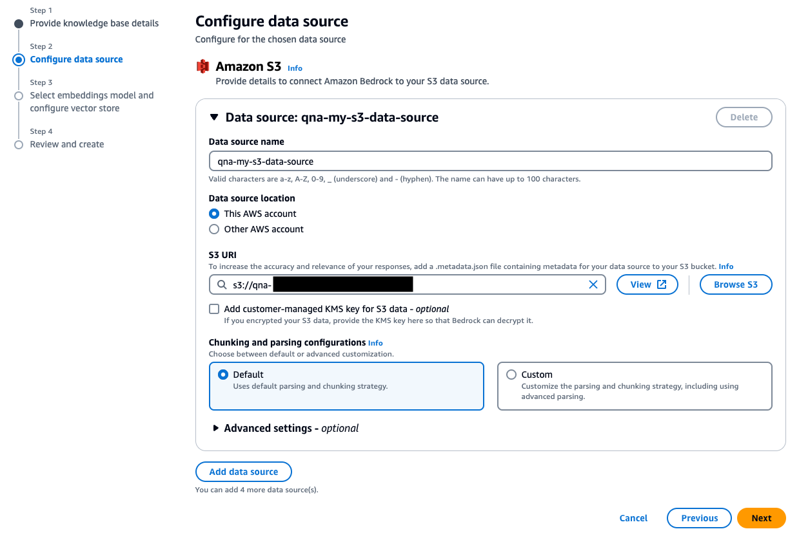

# Retrieval Augmentation Generation (RAG) using Amazon Bedrock Knowledge Base:

By integrating with the [Amazon Bedrock Knowledge Base](https://aws.amazon.com/bedrock/knowledge-bases/), QnABot on AWS can generate concise answers to the user’s questions from configured data source(s). This prevents the need for users to sift through larger text passages to find the answer. You can also create your own knowledge base from files stored in an Amazon S3 bucket. Amazon Bedrock knowledge bases with QnaBot do not require `EmbeddingsApi` and `LLMApi` since the embeddings and generative response are already provided by the knowledge base. To enable this option, create an Amazon Bedrock knowledge base and copy your knowledge base ID into the CloudFormation parameter `BedrockKnowledgeBaseId` and select model the model using the CloudFormation parameter `BedrockKnowledgeBaseModel`. 

In addition to answers generated, QnABot also provides context and [signed S3 URLs](https://docs.aws.amazon.com/AmazonS3/latest/userguide/using-presigned-url.html) to documents stored in S3 buckets that knowledge base returns in its response. These signed URLs are a secure way to grant temporary access to specific objects or resources within an Amazon S3 bucket.

With this integration, QnABot on AWS can answer a question and its follow-up from documents stored in Amazon S3. For example, from the [AWS Whitepaper](https://docs.aws.amazon.com/pdfs/whitepapers/latest/aws-overview/aws-overview.pdf) file, the following questions can be answered:

•	What services are available in AWS for container orchestration?

•	Are there any upfront fees with ECS?

## Amazon Bedrock Knowledge Base Models:
- [Titan Text G1 - Premier](https://us-east-1.console.aws.amazon.com/bedrock/home?region=us-east-1#/providers?model=amazon.titan-text-premier-v1:0)
- [Anthropic Claude Instant 1.2](https://us-east-1.console.aws.amazon.com/bedrock/home?region=us-east-1#/providers?model=anthropic.claude-instant-v1)
- [Anthropic Claude 2.1](https://us-east-1.console.aws.amazon.com/bedrock/home?region=us-east-1#/providers?model=anthropic.claude-v2:1)
- [Anthropic Claude 3 Sonnet](https://us-east-1.console.aws.amazon.com/bedrock/home?region=us-east-1#/providers?model=anthropic.claude-3-sonnet-20240229-v1:0)
- [Anthropic Claude 3 Haiku](https://us-east-1.console.aws.amazon.com/bedrock/home?region=us-east-1#/providers?model=anthropic.claude-3-haiku-20240307-v1:0)

## Amazon Bedrock Knowledge Base Quick Setup:
> **_NOTE:_** 
Before getting started, please verify [supported regions and models for Knowledge bases for Amazon Bedrock](https://docs.aws.amazon.com/bedrock/latest/userguide/knowledge-base-supported.html). To configure QnABot to use Bedrock Knowledge Base, you will first need to [create a knowledge base](https://docs.aws.amazon.com/bedrock/latest/userguide/knowledge-base-create.html). Below is a quick setup guide to get started:

- Provide Knowledge Base details

    

- Configure your data source based on available options. Here we will configure data source for S3. 
    > **_NOTE:_** If you want to enable S3 presigned URLs, the S3 bucket names must start with `qna` (e.g. qnabot-mydocs). In addition, make sure the IAM Role *...FulfillmentLambdaRole...* has been granted S3:GetObject access to the Bedrock Knowledge Base bucket (otherwise the signed URLS will not have access). Finally, you can encrypt the transient messages using your own KMS key; ensure that when creating the KMS key that the IAM Role *...FulfillmentLambdaRole...* is a key user.
    
    

- Upload your documents in S3. Here we uploaded the [aws-overview.pdf](https://docs.aws.amazon.com/pdfs/whitepapers/latest/aws-overview/aws-overview.pdf) whitepaper as a test.

- Sync Data source and Copy your Knowledge base ID into the CloudFormation parameter BedrockKnowledgeBaseId

    

## Configure Knowledge Base using the following Cloudformation parameter

### BedrockKnowledgeBaseId

**Optional** - ID of an existing Bedrock knowledge base. This setting enables the use of Bedrock knowledge bases as a fallback mechanism when a match is not found in OpenSearch.

### BedrockKnowledgeBaseModel

**Optional** -  Required if BedrockKnowledgeBaseId is not empty. Sets the preferred LLM model to use with the Bedrock knowledge base. Please ensure you have [requested model access](https://docs.aws.amazon.com/bedrock/latest/userguide/model-access.html) in Bedrock console, before deploying.

## Configure settings for RAG with Amazon Bedrock Knowledge Base in Content Designer:

- **KNOWLEDGE_BASE_PROMPT_TEMPLATE:** The prompt template used to construct a prompt for LLM specified in `BedrockKnowledgeModel` to generate an answer from the context of a retrieved results from Knowledge Base. To opt out of sending a prompt to the Knowledge Base model, simply leave this field empty. The template can use the following placeholders:
    - 	`$query$` – The user query sent to the knowledge base.
    - 	`$search_results$` - The retrieved results for the user query.
    - 	`$output_format_instructions$` - The underlying instructions for formatting the response generation and citations. Differs by model. If you define your own formatting instructions, we suggest that you remove this placeholder. Without this placeholder, the response won't contain citations.
    - 	`$current_time$` - The current time

    To learn more about prompt template and supported model for these placeholders, see `Knowledge Base Prompt Template` in [Query configurations](https://docs.aws.amazon.com/bedrock/latest/userguide/kb-test-config.html#kb-test-config-prompt-template).
- **KNOWLEDGE_BASE_MODEL_PARAMS:** Parameters sent to the LLM specified in cloudformation parameter BedrockKnowledgeModel when generating answers from Knowledge Base (e.g. anthropic model parameters can be customized as `{"temperature":0.1}` or `{"temperature":0.3, "maxTokens": 262, "topP":0.9, "top_k": 240 }`). For more information, please refer to [Inference parameters](https://docs.aws.amazon.com/bedrock/latest/userguide/kb-test-config.html)
- **KNOWLEDGE_BASE_PREFIX_MESSAGE:** Message to append in the chat client when the knowledge base generates a response.
- **KNOWLEDGE_BASE_SHOW_REFERENCES:** Enables or disables inclusion of the passages used as context for Bedrock Knowledge Base generated answers.
- **KNOWLEDGE_BASE_S3_SIGNED_URLS:** Enables or disables S3 presigned URL signing for Bedrock Knowledge Base answers.
- **KNOWLEDGE_BASE_S3_SIGNED_URL_EXPIRE_SECS:** Determines length of time in seconds for the validity of signed S3 Urls for Bedrock Knowledge Base answers.
- **KNOWLEDGE_BASE_MAX_NUMBER_OF_RETRIEVED_RESULTS:** Sets maximum number of retrieved result where each result corresponds to a source chunk. When querying a knowledge base, Amazon Bedrock returns up to five results by default. For more information, please refer to [Maximum number of retrieved results](https://docs.aws.amazon.com/bedrock/latest/userguide/kb-test-config.html).
- **KNOWLEDGE_BASE_SEARCH_TYPE:** Select the search type which defines how data sources in the knowledge base are queried. If using an Amazon OpenSearch Serverless vector store that contains a filterable text field, you can specify whether to query the knowledge base with a `HYBRID` search using both vector embeddings and raw text, or `SEMANTIC` search using only vector embeddings. For other vector store configurations, only `SEMANTIC` search is available. For more information, please refer to [Search type in Knowledge base](https://docs.aws.amazon.com/bedrock/latest/userguide/kb-test-config.html)
- **KNOWLEDGE_BASE_METADATA_FILTERS:** Specifies the filters to use on the metadata in the knowledge base data sources before returning results. (e.g filters can be customized as`{"filter1": { "key": "string", "value": "string" }, "filter2": { "key": "string", "value": number }}`). For more information, please refer to [Metadata and filtering](https://docs.aws.amazon.com/bedrock/latest/userguide/kb-test-config.html).