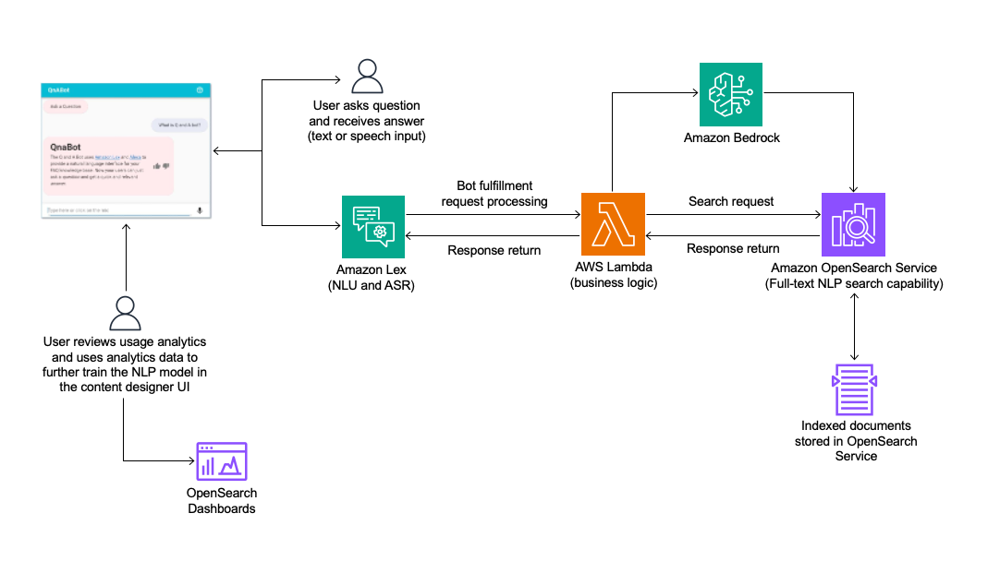

# Overview

Chatbots are a great way to make information available for your users. With QnABot you can deploy a chatbot in just a few steps and have a fully functional chat experience setup in under an hour.

Once the solution is deployed, you have a QnABot designer console where you can build and manage your question and answer bank. The question and answer bank become your knowledge base and the main source of information for QnABot to interact with to provide users' with relevant answers.

## Solution architecture and how It works

Three key AWS services are at the core of the solution:

- **Amazon Lex** is a service for building conversational interfaces into any application using voice and text. Amazon Lex provides the advanced deep learning functionalities of automatic speech recognition (ASR) for converting speech to text, and natural language understanding (NLU) to recognize the intent of the text to enable you to build applications with highly engaging user experiences and lifelike conversational interactions.
- **Amazon OpenSearch** is an open-source search and analytics engine for use cases such as log analytics, real-time application monitoring, and clickstream analysis. Amazon OpenSearch is a managed service that makes it simple to deploy, operate, and scale OpenSearch clusters in the AWS Cloud. The service offers open-source Amazon OpenSearch APIs, managed OpenSearch Dashboards, and integrations with Logstash and other AWS services, enabling you to securely ingest data from any source and search, analyze, and visualize it in real time.
- **Amazon Kendra** is an intelligent search service powered by machine learning. Kendra reimagines enterprise search for your websites and applications so your employees and customers can easily find the content they are looking for, even when it’s scattered across multiple locations and content repositories within your organization.

Let's take a closer look at these three services and how they help power
the QnABot solution.

When you ask QnABot a question, a few things happen:

1. The question gets processed and transcribed by Amazon Lex using a Natural Language Understanding (NLU) and Processing (NLP) engine.
    - QnABot initially trains the NLP to match a wide variety of possible questions and statements, so that the Amazon Lex bot can accept just about any question a user might ask. The Amazon Lex interaction model is setup with:
        - **Intents**: An intent represents an action that fulfills a user's spoken request. Intents can optionally have arguments called **slots**. The QnABot uses **slots** to capture user input and fulfills the Intent via Lambda function.
        - **Sample utterances**: A set of likely spoken phrases mapped to the intents. This should include as many representative phrases as possible. The sample utterances specify the words and phrases users can say to invoke your intents. QnABot updates the **Sample utterances** with the various questions to train the chatbot to understand different user input
2. The Bot fulfillment Lambda function generates an OpenSearch query containing the transcribed question. The query attempts to find the best match from all the questions and answers you’ve previously provided.
3. This request is then sent to Amazon OpenSearch. QnABot attempts to match a user's question to the list of questions and answers (created in the QnABot content designer) stored in Amazon OpenSearch.
4. (Optional) If an answer is not found in OpenSearch and Amazon Kendra is configured, QnABot will search documents or web pages in your Kendra index.

## Monitoring Usage

QnABot includes a visualization tool (using OpenSearch Dashboards) to analyze QnABot usage. OpenSearch Dashboards is an open-source data visualization and exploration tool used for log and time-series analytics, application monitoring, and operational intelligence use cases. It offers powerful and easy-to-use features such as histograms, line graphs, pie charts, heat maps, and built-in geospatial support. Also, it provides tight integration with OpenSearch, which makes OpenSearch Dashboards the default choice for visualizing data stored in OpenSearch.

The [OpenSearch Dashboards](./images/image9.png) can be used to view usage history, logged utterances, no hits utterances, positive user feedback, and negative user feedback and also provides the ability to create custom reports.
